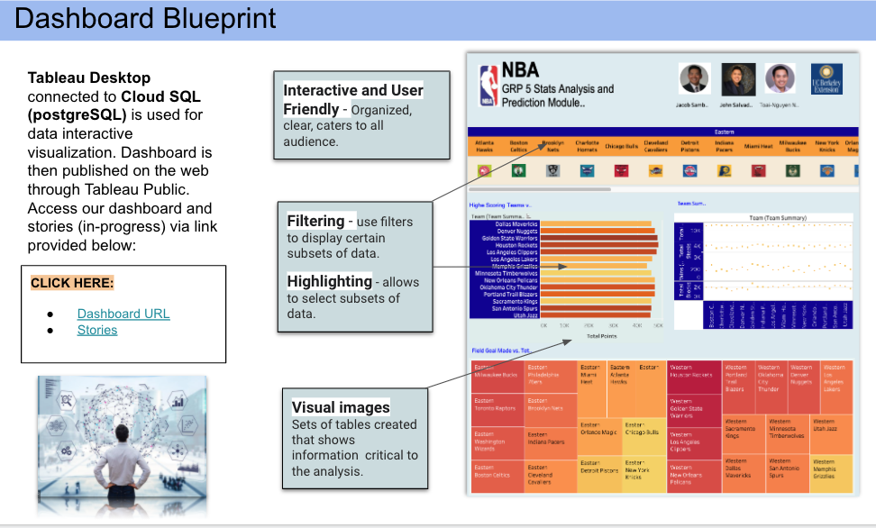

### Segment 2 Overview:

The circle role in this segment continues to refine the analysis. This includes generating at least three images to use in the presentation and with the dashboard. The following deliverables are required:

A blueprint for the dashboard is created and includes all of the following:

✓ Storyboard on Google Slide(s)

✓ Description of the tool(s) that will be used to create final dashboard

✓ Description of interactive element(s)

### Deliverables:

**1) Presentation Slides** 

[Link to the NBA Stats Analysis Google Slides](https://docs.google.com/presentation/d/15FJdZAEZWmijdhovykL48H5_bhHrKH4fqiXHvQegeHI/edit?ts=60347186#slide=id.gbfbce31b8d_0_11)

**2) Tools to create the Dashboard:**

*Below is a list of all the tools that were used in order to generate data visualization in Tableau.*

**3) Dashboard Blueprint with Interactive Element(s) Description:** 

*Our team has decided to use Tableau Desktop as the application for data visualization. Tableau is a business intelligence and data visualization tool. It specializes in transforming tabulated data into interactive graphs and representations.* 

