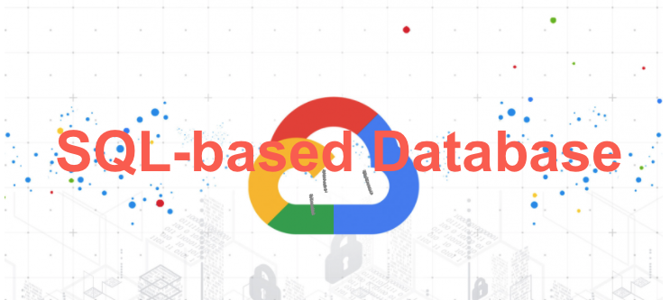
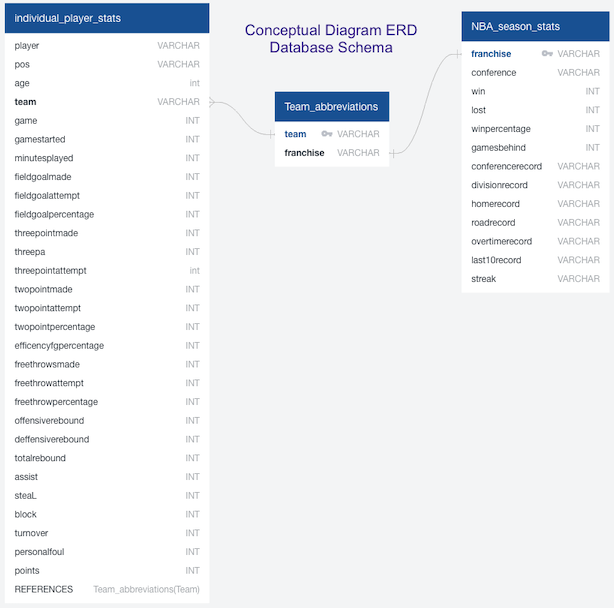
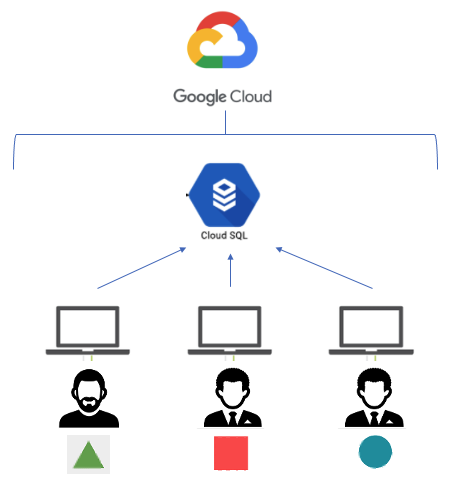

### Segment 1 Overview:

The circle role is in charge of the mockup database. The following deliverables are required:

- SQL-based database
- ERD of the database is provided
- A document (this report) pointing out how it is integrated into the database and how it works with the code.
- A sample data is used to test it. 

The data used storing into the database are provided in the main repository along with the rest of the database-related work.

### Deliverables:

**1) SQL-based database:** 

*A Cloud SQL was choosen as the appropriate SQL-based database for this project and an excellent alternative to a local PostgreSQL. It is a fully-managed database service that helps set up, maintain, manage, and administer relational databases on Google Cloud Platform where everyone in the team can access.* 

**2) Database ERD:**

*Below is a schematic of the entity relationship diagram (ERD) that shows the relationships of entity sets that we plan to store in our database.*

**Figure 1**

[Link to the postgreSQL schema](https://github.com/JmSambajon/group5-project/blob/main/Resources/schema.sql)

**3) Sample Data, Integration, and Use** 

*Three national basketball association (NBA) datafile sets were choosen to perform data and machine learning analysis. The links are provided in the main repository README.*

- Team Abbreviation
- Individual Player Stats
- NBA Season Stats

[Link to the group5-project Main GitHub Repository](https://github.com/JmSambajon/group5-project)

*A collection of database objects (e.g. tables) based from the ERD schematic above are created in SQL. The datafiles are either uploaded directly into the SQL database or exported using python scripts in jupyter notebook. Once the table is completed, the datafiles are verified by importing the tables back in jupyter notebook. Refer to attached NBA database.ipynb notebook in the main repository.* 

[Link to the NBA Database.ipynb](https://github.com/JmSambajon/group5-project/blob/main/NBA%20Database.ipynb)

*The rest of the Team members were notified. Network IP address were authorized to grant access in the google Cloud SQL account. PostgreSQL servers were then setup for each team members so that they can access the database.* 

**Database Operation Flow Diagram**

