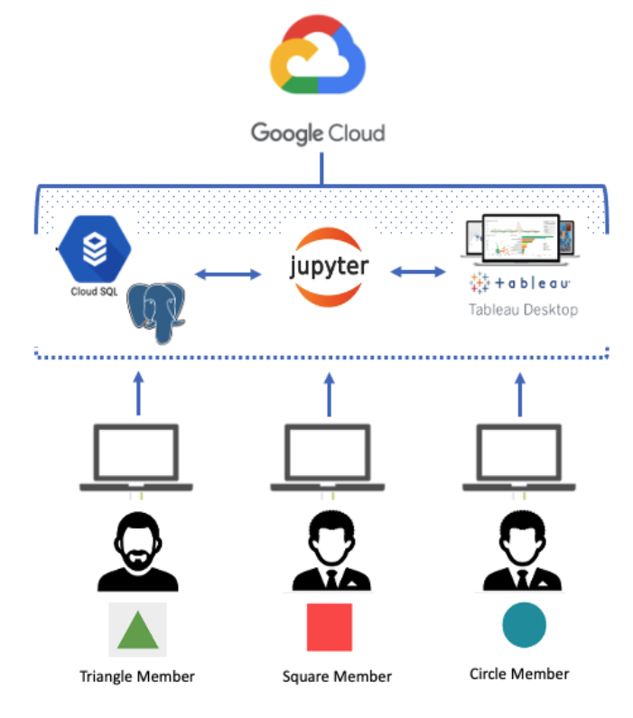
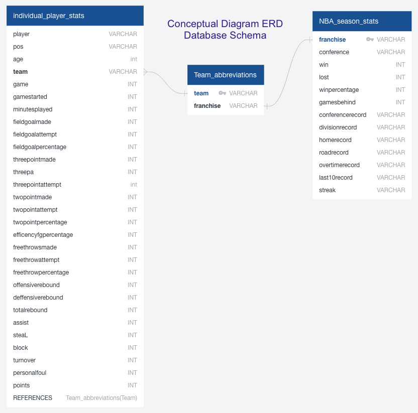
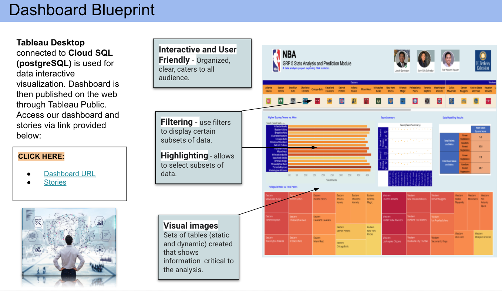

## Overview of the Analysis
Through our common interest in basketball we wanted to dig deeper into NBA team statistics. Our plan is to use NBA stats to predict the winner of the current NBA season. 

## Questions we want to answer
* Is there a correlation between higher scoring teams and wins?
* Does defense statistics correlate with team wins?
* How accurate is our model?

**Dataset sources:**

* [Link to NBA individual player statistics](https://www.basketball-reference.com/leagues/NBA_2021_per_game.html) Our data was pulled on 2/18/2021

* [Link to NBA team franchise names and abbreviations](https://en.wikipedia.org/wiki/Wikipedia:WikiProject_National_Basketball_Association/National_Basketball_Association_team_abbreviations)

* [Link to NBA team standings](https://www.nba.com/standings) Our data was pulled on 2/18/2021

**Fields of importance Examples:**

* Points
* Wins
* Field Goal Made
* Defensive Rebounds
* Blocks
* Steals

## Business Application Softwares

**Google Cloud SQL** - *a fully-managed database service that helps set up, maintain, manage, and administer relational databases on Google Cloud Platform.*

**PostgreSQL** - *a highly stable database management system used as the primary data store or data warehouse for analytics applications.*

**Jupyter Notebook** - *an open-source web application that allows creation and sharing of documents that contain live code, equations, visualizations and explanatory text. Use for data cleaning and transformation, numerical simulation, statistical modeling, machine learning.*

**Tableau Desktop / Public** - *a business intelligence and data visualization tool. It specializes in transforming tabulated data into interactive graphs and representations.*

## Database Setup and Exploratory Data
Our database contains three tables. More information on the database setup can be found here:

[Link to the Database Information README](https://github.com/JmSambajon/group5-project/blob/johns_data_analytics/DatabaseInfo.md)

Here is an ERD of our database:

## Data Analysis and Machine Learning

We plan to use a linear regression model. More information on the model can be found here:

[Link to the Model Information README](https://github.com/JmSambajon/group5-project/blob/main/MachineLearningMDW3.md)

## Data Visualization and Dashboard:

The dashboard was created using Tableau Desktop and Public. More information on the dashboard creation can be found in the links provided below:

[Link to the Data Visualization and Dashboard README](https://github.com/JmSambajon/group5-project/blob/main/Circle_Segment2.md)

**Dashboard Blueprint:**

All deliverables can be found using the links below:

[Link to Tableau Dashboard](https://public.tableau.com/profile/john.s.2695#!/vizhome/Dashboard1_16143159757440/Dashboard2?publish=yes)

[Link to Tableau Story](https://public.tableau.com/profile/john.s.2695#!/vizhome/Dashboard1_16143159757440/Dashboard2?publish=yes)

[Link to Multiple Linear Regression notebook](https://github.com/JmSambajon/group5-project/blob/main/Refined%20Model%20for%20Segment%202.ipynb)

[Link to Joined data sql schema](https://github.com/JmSambajon/group5-project/blob/main/Joined_data_schema.sql)

[Link to the Google Presentation](https://docs.google.com/presentation/d/15FJdZAEZWmijdhovykL48H5_bhHrKH4fqiXHvQegeHI/edit?usp=sharing)

## Results

## Summary
