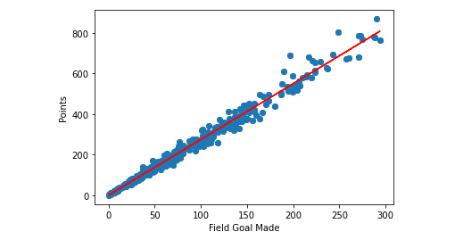

# Machine Learning Modelling

## Overview
The purpose of this analysis to choose a machine learning module for the individual player stats. To get started in the first segment is to create a simple model that fits with the dataset.

## Resources
Three national basketball association (NBA) datafile sets were choosen to perform data and machine learning analysis. The links are provided in the main repository README.

- Team Abbreviation
- Individual Player Stats
- NBA Season Stats

## Analysis
To perform the Machine Learning Module, the data above were pulled from the SQL Database. The Linear Regression Module was chosen from the "individual_player_stats". The data set to analyze was "Field Goal Made" vs the "Points".

For future machine learning modules to be complete on the NBA data sets, the Individual Player Stats, NBA Season Stats, and Team Abbreviations datasets will need to merge to generate win and loss ratio based on individual stats.

## Conclusion
Based on the analysis, there is a direct correlation between Field Goal Made and Points. This means that if an individual player makes more Field Goals, they will be scoring more points.

