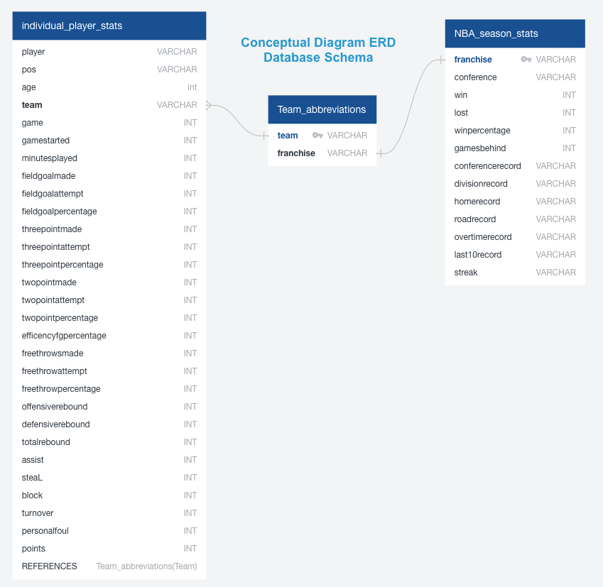

## Overview of the Analysis
Through our common interest in basketball we wanted to dig deeper into NBA team statistics. Our plan is to use NBA stats to predict the winner of the current NBA season. 

Data-set sources:
* [Link to NBA individual player statistics](https://www.basketball-reference.com/leagues/NBA_2021_per_game.html) Our data was pulled on 2/18/2021

* [Link to NBA team franchise names and abbreviations](https://en.wikipedia.org/wiki/Wikipedia:WikiProject_National_Basketball_Association/National_Basketball_Association_team_abbreviations)
* [Link to NBA team standings](https://www.nba.com/standings) Our data was pulled on 2/18/2021

## Communication Protocol
* Slack on both computers and mobile devices
* Weekly meetings on Mondays, Wednesdays and when necessary

## Questions we want to answer
* How accurate is our model?
* Is there a correlation between higher scoring teams and winning probability?
* Does defense actually win championships?
* Does having a lot of turnovers cause more losses?

## Fields of importance
* Total Field goal percentage
* Free throw percentage
* 3 pointer mades
* 3 pointer attempts
* 3 pointer percentage
* 2 pointer made
* 2 pointer attempts
* 2 pointer percentage
* Total points
* Offensive rebounds
* Defensive rebounds
* Total assists
* Total steals
* Total blocks
* Amount of turnovers

## Database setup
Our database contains three tables. More information on the database setup can be found here:

[Link to the Database Information README](https://github.com/JmSambajon/group5-project/blob/toai_data_analytics/MachineLearningMD.md)

Segment 1 Requirements:
Provisional database that stands in for the final database and accomplishes the following:
* Sample data that mimics the expected final database structure or schema
* Draft machine learning module is connected to the provisional database

Here is an ERD of our database:

## Analysis

Machine learning model that stands in for the final machine learning model and accomplishes the following:
* Takes in data in from the provisional database
* Outputs label(s) for input data

We plan to use a linear regression model. More information on the model can be found here:

[Link to the Model Information README](https://github.com/JmSambajon/group5-project/blob/toai_data_analytics/README.md)

## Results

## Summary
